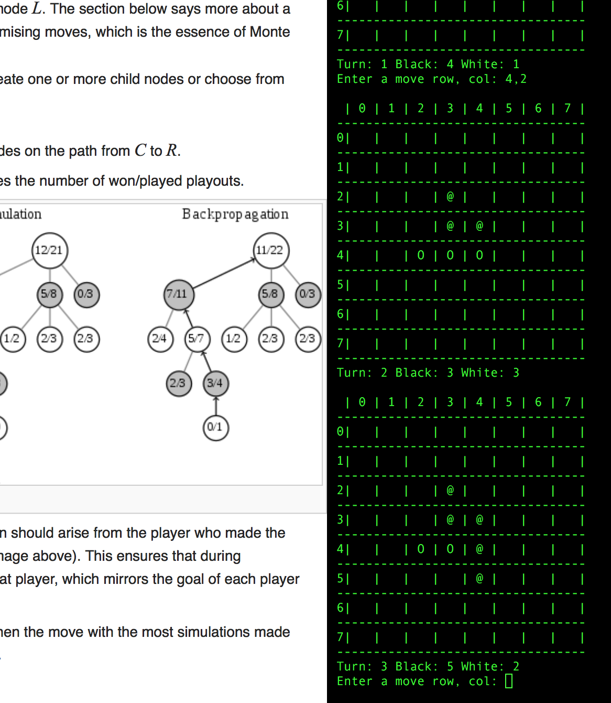

# Reversi - an automated player

## How to run 

```shell
cd reversi\python
python reversi.py
```

Just follow the command menu which will ask you to choose a player type for black and white.  

```
Choose a black player type
----------------------------------------
[1] Manual (Human) Player
[2] Random Player
[3] MiniMax (Naive) Player
[4] MiniMax (Alpha Beta Pruning) Player
[5] Monte Carlo Tree Search Player
----------------------------------------
Enter [1-6]: 
```

The following sections will explain available player types.

## Random Player

This player randomly chooses a move from the legal moves.

- not very strong
- occasionally hits a very nice move
- very quick to decide the next move
- does not learn from experience

## Manual (aka Human) Player

You can play by entering your move.

```
[20:47:26] Turn: 2 (ManualPlayer)
 | 0 | 1 | 2 | 3 | 4 | 5 | 6 | 7 | 
----------------------------------
0|   |   |   |   |   |   |   |   | 
----------------------------------
1|   |   |   |   |   |   |   |   | 
----------------------------------
2|   |   |   |   |   |   |   |   | 
----------------------------------
3|   |   |   | O | @ |   |   |   | 
----------------------------------
4|   |   |   | @ | @ |   |   |   | 
----------------------------------
5|   |   |   |   | @ |   |   |   | 
----------------------------------
6|   |   |   |   |   |   |   |   | 
----------------------------------
7|   |   |   |   |   |   |   |   | 
----------------------------------
Black: 4 (MonteCarloTreeSearchPlayer)
White: 1 (ManualPlayer)
Enter a move row, col: 5,3   <= enter your move!
```

- weak or strong (depends on the mood)
- can be thinking very long but won't forgive the opponent for taking time 
- could/would/should learn from experience

## Minimax Player (aka Naive Minimax)

This player uses the [minimax](https://en.wikipedia.org/wiki/Minimax) decision rule. 

- requires a max_depth parameter (how deep it should think ahead)
  + max_depth = 3 => it's quick but not very strong
  + max_depth = 5 => it's slow and stronger than RandomPlayer

A big max_depth (>5) means you need to wait much longer as it will drill down 
into all the possible moves up to the max depth.

If you are human, you'll need to be doing something else while waiting.  

The below image shows when I was playing while reading an article on wikipedia.



## Minimax with Alpha Beta Pruning

This player uses [an improved minimax](https://en.wikipedia.org/wiki/Alpha–beta_pruning) logic.

- skips unnecessary tree search (faster than the naive minimax logic)

It is faster than the naive Minimax player.  You can try with max_depth = 7 which
is pretty strong.  

It takes a few minutes per turn which you may still feel quite slow.
It is still going through many possible plies recursively.

Also, you it plays the same opening moves every time as there is no randomness involved.
I could introduce some randomness when there are multiple best moves available but
let's not spend too much effort and move on to the next player type which naturally
makes use of randomness.

## Monte Carlo Tree Search

This player uses [random (monte carlo) simulation of tree search](https://en.wikipedia.org/wiki/Monte_Carlo_tree_search) to find out 
which move will most likely make the player win.

It does not check all the possible game turns (plies) recursively.  
It randomly chose a path till the end to find out the ultimate outcome (win/lose).
When all immediate child nodes are explored, it uses UCT (Upper Confidence Bound 1 applied to trees) to exploit the experience.
This process is repeated within a time frame give (say max seconds = 5 ~ 10).
Then, it decides which move is most likely to make the player a winner.

It seems quite strong.  I let it plays with Minimax with Alpha/Beta and it won all the time 
(I guess the result may be different on your PC depending on the max seconds and CPU power).

This player learns from the experience as it plays but it forgets everything once the game is over.

## Deep-Q Network (Work In Progress)

This player uses [Q-learning](https://en.wikipedia.org/wiki/Q-learning) (from Reinforcement Learning).
There are so many combiation of (state, action) to fit into a computer memory.
So, we use a neural network as an approximation of Q-function.

This agent will learn from the experience.


## References
- https://andysalerno.com/2016/03/Monte-Carlo-Reversi
- https://jeffbradberry.com/posts/2015/09/intro-to-monte-carlo-tree-search/
- http://aima.cs.berkeley.edu/python/games.html
- http://outlace.com/Reinforcement-Learning-Part-3/
- https://www.nervanasys.com/demystifying-deep-reinforcement-learning/

