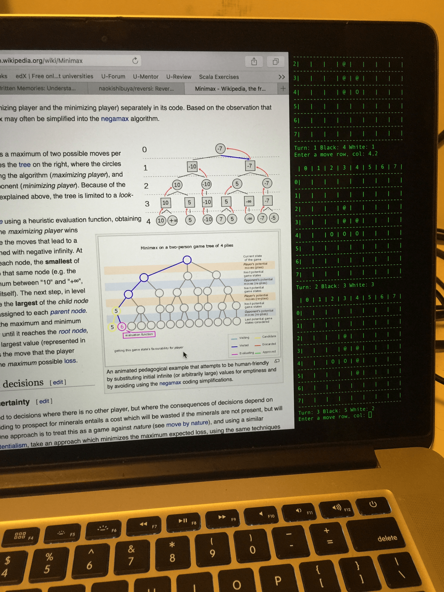

# Reversi - an automated player

## How to run 

```bash
cd reversi\python
python reversi.py
```

Just follow the command menu which will ask you to choose a player type for black and white.  

```bash
[1] Random Player
[2] MiniMax Player
[3] Manual Player (You)
Enter [1-3]: 
```

The following sections will explain available player types.

## Random Player

This player randomly chooses a move from the legal moves.

- not very strong
- occasionally hits a very nice move
- very quick to decide the next move
- does not learn from experience

## Manual (aka Human) Player

You can play by entering your move.

```bash
 | 0 | 1 | 2 | 3 | 4 | 5 | 6 | 7 | 
----------------------------------
0| O | O | O | O | O | O |   |   | 
----------------------------------
1| O | O | O | O |   | @ |   |   | 
----------------------------------
2| O | O | O | O | @ | @ |   |   | 
----------------------------------
3| O | O | O | O | O |   |   |   | 
----------------------------------
4| O | O | @ | O | O | O |   |   | 
----------------------------------
5| O | O | @ | O | @ | @ | @ |   | 
----------------------------------
6|   | @ | @ | @ | @ | @ |   |   | 
----------------------------------
7| @ |   | @ | @ | @ | O |   |   | 
----------------------------------
Turn: 41 Black: 17 White: 28
Enter a move row, col: 1,2    <=== enter your next move in (row,col)
```

## Minimax Player

This player uses the minimax decision rule. 

- requires a max_depth parameter (how deep it should think ahead)
- max_depth = 3 => it's quick but not very strong
- max_depth = 5 => it's slow and stronger than RandomPlayer

Bigger max_depth means you need to wait much longer.  

The below image shows when I was playing while reading an article on wikipedia.



https://en.wikipedia.org/wiki/Minimax

## Minimax with Alpha Beta Pruning

TODO implementing...

- skips unnecessary tree search
- faster than base Minimax Player

https://en.wikipedia.org/wiki/Alpha–beta_pruning


## Monte Carlo Tree Search

TODO implementing...

https://en.wikipedia.org/wiki/Monte_Carlo_tree_search

## Deep-Q Network

TODO implementing...

https://en.wikipedia.org/wiki/Deep_learning
https://en.wikipedia.org/wiki/Q-learning
https://deepmind.com/dqn
